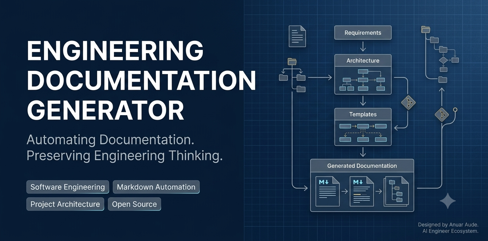

<p align="center">
  
</p>

# Engineering Documentation Generator

[](https://github.com/anuaraude/Engineering-Documentation-Generator/actions/workflows/tests.yml)

> A modular command-line tool for assembling standardized engineering documents from reusable Markdown section templates.

---

## About

Engineering projects often require documentation before implementation can begin.

Although every project has different objectives, many documentation tasks follow recurring structures. Rewriting these sections manually consumes time and can produce inconsistent results.

The Engineering Documentation Generator addresses this problem by collecting project information and assembling documents from independent Markdown section templates.

The objective is not to replace engineering judgment, but to automate repetitive formatting and documentation tasks while keeping the user in control of the final content.

---

## Philosophy

> Automate repetitive work, not creative thinking.

The `templates` directory acts as a reusable section library for engineering documents.

The current release focuses on the mandatory README Core sections. The generator requests the required project information and assembles the sections in a standardized order from reusable Markdown templates.

---

## Quick Start

### Requirements

- Python 3.9 or later.
- Git, if the repository will be cloned from GitHub.

The current version uses only the Python standard library and does not require third-party packages.

### Installation

Clone the repository and enter the project directory:

```bash
git clone https://github.com/anuaraude/Engineering-Documentation-Generator.git
cd Engineering-Documentation-Generator
```

### Run the Application

```bash
python -m src.main
```

The application will guide the user through document selection, project information collection, README preview, and file saving.

By default, generated documents are saved as `README.md` inside the `output` directory. A different destination folder can be selected during execution.

---

## Development Setup

Install the development dependencies:

```bash
python -m pip install -r requirements-dev.txt
```

The application has no third-party runtime dependencies. Development tools such as `pytest` are maintained separately in `requirements-dev.txt`.

The automated suite contains 29 tests covering README generation, explicit Core configuration validation, configuration-template compatibility, file creation, overwrite protection, final-newline handling, and UTF-8 output.

### Run the Test Suite

```bash
python -m pytest tests -v
```

The current automated suite covers README generation, configuration-template compatibility, file creation, overwrite protection, final-newline handling, and UTF-8 output.

---

## Current Capabilities

The current implementation supports:

- Command-line project and document selection.
- Validation of menu options and required text fields.
- Collection of all mandatory README Core information.
- Modular Markdown section templates.
- Placeholder replacement using project configuration data.
- Explicit validation of all required README Core configuration fields.
- Domain-specific reporting of all missing fields in a single error.
- Automated verification through 29 pytest tests.
- Continuous integration with GitHub Actions on pushes and pull requests targeting `main`.
- Assembly of six independent Core templates into one README document.
- Separation of configuration validation into an independent contract module.
- Interactive Markdown preview and save confirmation.
- Selection and automatic creation of the destination folder.
- Saving the generated document as `README.md`.
- Overwrite protection for existing README files.
- UTF-8 file output.
- Separation of interface, configuration, template loading, document generation, review, and file-writing responsibilities.

---

## How It Works

The application follows a sequential command-line workflow:

```text
Select a document type
→ Enter the required project information
→ Validate the provided input
→ Build the document configuration
→ Load the corresponding Markdown templates
→ Generate the README content
→ Display the Markdown preview
→ Confirm whether the document should be saved
→ Select a destination folder
→ Save the document as README.md
```

If a `README.md` file already exists in the selected folder, the application requests confirmation before overwriting it.

---

## Architecture Overview

The project separates command-line interaction, data organization, document generation, review, and file output into independent modules.

```text
main.py
├── user_interface.py
├── configuration.py
├── document_generator.py
├── review_manager.py
└── file_writer.py

document_generator.py
├── uses readme_contract.py
└── uses template_manager.py
```

### Module Responsibilities

- `user_interface.py`: displays menus, validates input, and collects project information.
- `main.py`: coordinates the complete application workflow.
- `configuration.py`: organizes the collected information into structured document configuration data.
- `template_manager.py`: locates and loads the required Markdown templates.
- `document_generator.py`: validates the configuration contract, replaces placeholders, and assembles the final Markdown document.
- `review_manager.py`: handles save decisions, destination selection, and overwrite confirmation.
- `file_writer.py`: creates destination folders and writes the generated `README.md` file.
- `readme_contract.py`: defines the required README Core fields, validates configuration structure, and reports all missing fields through a domain-specific exception.

This separation keeps each module focused on one primary responsibility and makes the application easier to maintain, test, and extend.

---

## Current README Sections

### Implemented

- Header
- About
- Getting Started
- Project Status
- Author
- License

### Deferred Scope

The following capabilities were intentionally excluded from the final version 0.6 scope:

- Optional README sections.
- Technical Knowledge Document generation.
- Graphical interfaces.
- Python package distribution.

These capabilities are not part of the active roadmap and may be reconsidered only if a concrete user need emerges.

---

## Project Structure

```text
Engineering-Documentation-Generator/
├── .github/
│   └── workflows/
│       └── tests.yml
├── assets/
├── docs/
│   ├── architecture-design.md
│   ├── project-requirements.md
│   └── readme-standard.md
├── src/
│   ├── __init__.py
│   ├── configuration.py
│   ├── document_generator.py
│   ├── file_writer.py
│   ├── main.py
│   ├── readme_contract.py
│   ├── review_manager.py
│   ├── template_manager.py
│   └── user_interface.py
├── templates/
│   └── readme/
│       └── core/
│           ├── about.md
│           ├── author.md
│           ├── getting_started.md
│           ├── header.md
│           ├── license.md
│           └── project_status.md
├── tests/
│   ├── test_document_generator.py
│   ├── test_file_writer.py
│   └── test_readme_contract.py
├── .gitignore
├── LICENSE
├── README.md
├── requirements-dev.txt
└── requirements.txt
```

---

## Documentation

- [Project Requirements](docs/project-requirements.md)
- [Architecture Design](docs/architecture-design.md)
- [README Standard](docs/readme-standard.md)

## Project Status

✅ **Version 0.6 — Final engineering release**

The application collects validated project information, assembles all six mandatory README Core sections, displays a preview, and safely saves the generated document to a user-selected folder.

The final release includes explicit README Core configuration validation, domain-specific reporting of all missing required fields, 29 automated tests, and continuous integration through GitHub Actions.

This repository is complete as a focused software-engineering portfolio project. Active feature development is frozen.

Optional README sections, Technical Knowledge Document generation, graphical interfaces, and package distribution were intentionally deferred. They may be reconsidered only if a concrete user need emerges.

## License

This project is distributed under the terms defined in the [LICENSE](LICENSE) file.

*"Good software begins with good engineering."*